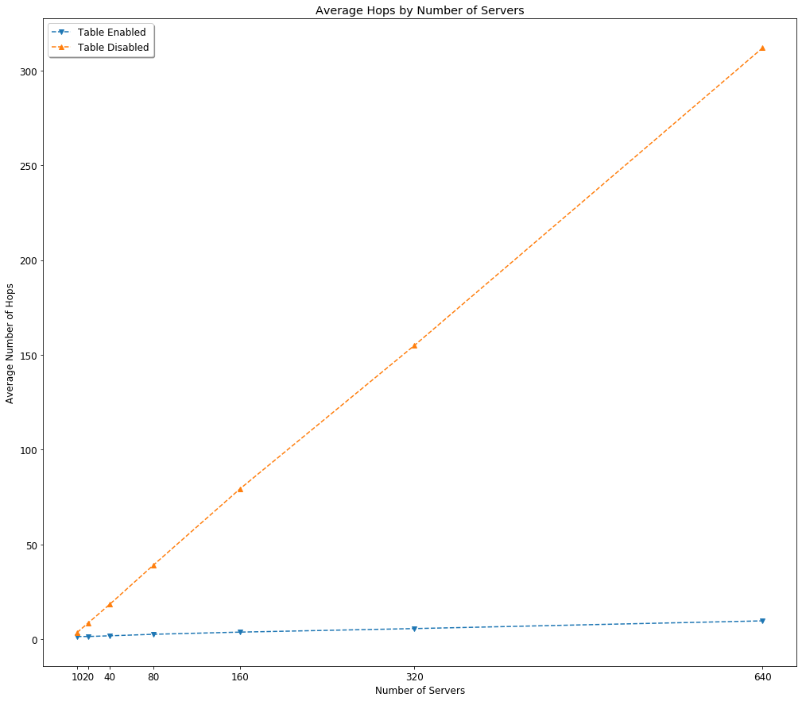

# CS441 Course Project - Chord Algorithm Akka/HTTP-based Simulator
#### Description: Create a Chord cloud overlay network algorithm with convergent hashing using Akka/HTTP-based simulator.
#### Team: Carlos Antonio McNulty (cmcnul3), Abram Gorgis (agorgi2), Priyan Sureshkumar (psures5), Shyam Patel (spate54)
This is a course project for CS441 at the University of Illinois at Chicago.
This project utilizes the open-source [Akka](https://akka.io) toolkit, simplifying the construction of concurrent and distributed applications on the Java Virtual Machine (JVM).


## [Background](https://bitbucket.org/cmcnul3/carlos_mcnulty_project/src/master/Documentation.pdf)
- This project is a simulator of a cloud overlay network that makes use of the Chord protocol, which specifies how to find the locations of keys for files
- Chord assigns keys to nodes using ***consistent hashing***, providing a degree of natural load balancing
- Chord is scalable, because it is not required that every node know about every other node, and the cost of a Chord lookup is always the log of the number of nodes
- Our simulation stores data about movies in files distributed across the network and supports inserts and lookups

## [Project Details](https://bitbucket.org/cmcnul3/carlos_mcnulty_project/src/master/build.sbt)
##### Driver Language:          Scala 2.13.1
##### Testing Framework:        ScalaTest
##### Building Framework:       SBT
##### Configuration Library:    Typesafe
##### Other:                    
                        1 simulation .conf files with name(s) application.conf

##### Main Driver Class:        WebServer in WebServer.scala

##### Required Library Dependencies:
```
  "ch.qos.logback" % "logback-classic" % "1.2.3",
  "com.typesafe.akka" %% "akka-actor-testkit-typed" % akkaVersion % Test,
  "com.typesafe.akka" %% "akka-actor-typed" % akkaVersion,
  "com.typesafe.akka" %% "akka-http" % "10.1.11",
  "com.typesafe.akka" %% "akka-http-spray-json" % "10.1.11",
  "com.typesafe.akka" %% "akka-stream" % akkaVersion,
  "org.scala-lang.modules" %% "scala-xml" % "1.2.0",
  "org.scalatest" %% "scalatest" % "3.0.8" % Test
```

## Running
To successfully run this project, [Docker Toolbox](https://docs.docker.com/toolbox), [IntelliJ IDEA](https://www.jetbrains.com/idea), [sbt](https://docs.scala-lang.org/getting-started/sbt-track/getting-started-with-scala-and-sbt-on-the-command-line.html) and [Java 8 JDK](https://www.oracle.com/technetwork/java/javase/downloads/index.html) (version 1.8 or higher) are required.

#### To Compile and Run 
##### Default Path of Dockerfile from project directory `/target/docker`: 
##### Use image hash from build:
                With DockerFile:
                    1. Start docker virtualbox VM via Kitematic or Docker for Windows etc
                    
                    2. Add port forwarding to Oracle VM virtual box to port 8080 for host port and
                       8080 for guest port
                    
                    3. Terminal Commands (here is the repo docker pull cs441/project:latest you shouldnt need this though)(yes,We claimed the cs441 name on dockerhub and are willing to trade it for extra credit)
                        docker login
                        docker build path/to/dockerfile (make sure to edit docker file CMD[] with proper arguments before building)
                        docker images
                        docker run  -p8080:8080 imagehash
                        
                    4. Change Command Line Arguments in Dockerfile at respective path
                       appropriately for differnt simulations as:
                       
                            (number or servers, set algorithm, system snapshot delay in seconds)
                            (500, true, 30)
                            
                    5. Use curl commands such as
                       curl localhost:8080/log to get constant logging info (Ctrl+C to stop),
                       curl localhost:8080/snapshot to get most recent snapshot,
                       curl put command with string "<filename>|<filesize>" to be inserted into the ring.

## [Tests](https://bitbucket.org/cmcnul3/carlos_mcnulty_project/src/master/src/test/scala/WebServerTests.scala)
This project includes 13 unit tests based on the [ScalaTest](http://www.scalatest.org) testing framework, which are located in the project's [`test/scala`](https://bitbucket.org/cmcnul3/carlos_mcnulty_project/src/master/src/test/scala) directory.
If you would like to run the tests, simply `cd` into the project root directory and enter the following command: `sbt test`.


## [Chord Algorithm](https://bitbucket.org/cmcnul3/carlos_mcnulty_project/src/master/Documentation.pdf)
For comparison, our simulator consists of two Chord algorithms.

- In one algorithm, a simple but slow Chord lookup algorithm is used
    - Lookups are implemented on a Chord ring in which each node only knows how to contact its current successor node on the identifier circle
    - As such, queries for a given identifier may be passed around the circle via these successor references until they encounter a node that consists of the desired identifier
    - For our implementation, we use the MD5 hashing algorithm to create node identifiers and keys
    - We created the Chord ring by hashing the names of each Akka actor and ordering them by identifier into a circular linked list, where each server/actor has a reference to both its predecessor and successor
    - In the simple form of the algorithm, we route messages through a server’s successor without consulting the finger table

- In the other, much improved algorithm, Chord maintains additional routing information
    - Each node maintains a routing table known as the ***finger table***
    - The first finger of a node *n* is the immediate successor of *n* on the identifier circle
    - In this scheme, each node stores information about only a small number of other nodes, and knows more about nodes closely following it on the identifier circle than about nodes farther away
    - As such, given that a node’s finger table generally does not contain enough information to directly determine the successor of an arbitrary key *k*, if the id to be searched does not immediately fall between *n* and its successor, node *n* searches its finger table for the node *n’* whose identifier most immediately precedes the id


## [Server Manager](https://bitbucket.org/cmcnul3/carlos_mcnulty_project/src/master/src/main/scala/ServerManager.scala)
- We created a server manager as the top level actor of the actor system
- This actor is responsible for spawning the child server actors and preparing the datacenter in stages
    - These stages include creating the Chord ring by distributing ids, predecessor and successor references
- The server manager then instructs all servers to create their respective routing tables
- When all servers have created their routing tables, the datacenter is ready to process insert and lookup requests from the web server
- The server manager is also responsible for coordinating system snapshots by communicating with all the servers in the system and requesting their states
- It will then produce XML files for each snapshot at specified intervals


## [Server(s)](https://bitbucket.org/cmcnul3/carlos_mcnulty_project/src/master/src/main/scala/Server.scala)
- Once the server manager has prepared each server actor, the actors are ready to receive insert and lookup requests
- The servers are also capable of receiving routing requests and forwarding these requests through the system using their routing tables
- These routing requests increment the number of hops until reaching their final destination
- The insert and lookup requests both rely on these routing messages, which allow us to track the number of hops made through the Chord ring for each request
- These requests are handled concurrently using anonymous child actors that are spawned for each request
- Servers store the number of insert and lookup requests, where they are the source of those requests, and the number of hops taken for each request


## [HTTP Web Server](https://bitbucket.org/cmcnul3/carlos_mcnulty_project/src/master/src/main/scala/WebServer.scala)/[Client](https://bitbucket.org/cmcnul3/carlos_mcnulty_project/src/master/src/main/scala/WebClient.scala)
- We created an *http* web server as the entry point for our datacenter
- It processes ***PUT*** and ***GET*** requests using the Akka HTTP API
- These requests are then forwarded to the server manager, which then selects a server at random from the datacenter to handle the request
- Once the server processes the request, the result is forwarded to the web server, and the web server is free to format the response as needed
- The web server also provides a special path to obtain the log and snapshot files from the simulation
- It should be noted that the log file can grow very large as the web server is processing thousands of requests from the client
- The client first makes a series of *PUT* requests to the web server and inserts file metadata
- It then begins issuing thousands of *GET* requests on randomly selected files to the web server


## [Analysis](https://bitbucket.org/cmcnul3/carlos_mcnulty_project/src/master/Documentation.pdf)
The following are the results we observed in our simulation.



###### Table 1. Average Number of Hops

|               | 10 servers | 20 servers | 40 servers | 80 servers | 160 servers | 320 servers | 640 servers |
|---------------|------------|------------|------------|------------|-------------|-------------|-------------|
| Simple alg.   |      3.612 |      8.524 |     18.463 |     39.077 |      79.481 |     154.963 |     311.842 |
| Scalable alg. |      1.519 |      1.517 |      1.873 |      2.676 |       3.826 |       5.685 |       9.757 |


- In the simple Chord algorithm simulation, in which the finger table is disabled, nodes merely contact their successor nodes on the Chord ring, which results in high numbers of hops when inserting and looking up files
    - As can be observed in **Table 1**, when the number of servers is doubled, the average number of hops is also doubled
    - Therefore, the number of servers has a ***linear*** relationship with the number of hops
- In the scalable Chord algorithm simulation, however, nodes use their finger tables to find successors, which results in fewer numbers of hops when inserting and looking up files
    - As can be observed in **Table 1**, when the number of servers is doubled, the average number of hops increases by a factor of log of the number of servers
    - Therefore, the number of servers has a ***logarithmic*** relationship with the number of hops
- This was more or less expected, because the finger table avoids the need for a linear search and significantly reduces the number of successor nodes that must be found in order to locate the key
    - With the finger table implementation of the Chord algorithm, the number of nodes which must be contacted to find a successor in an *n*-node cloud overlay network is ***O(log n)***

To view images and analysis, see [`Documentation.pdf`](https://bitbucket.org/cmcnul3/carlos_mcnulty_project/src/master/Documentation.pdf) located in the project root directory.
